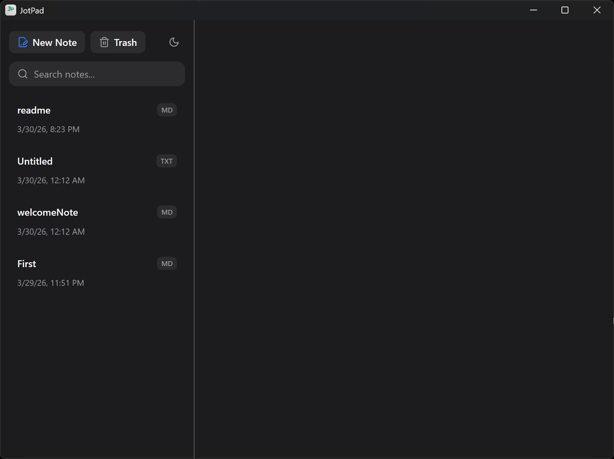
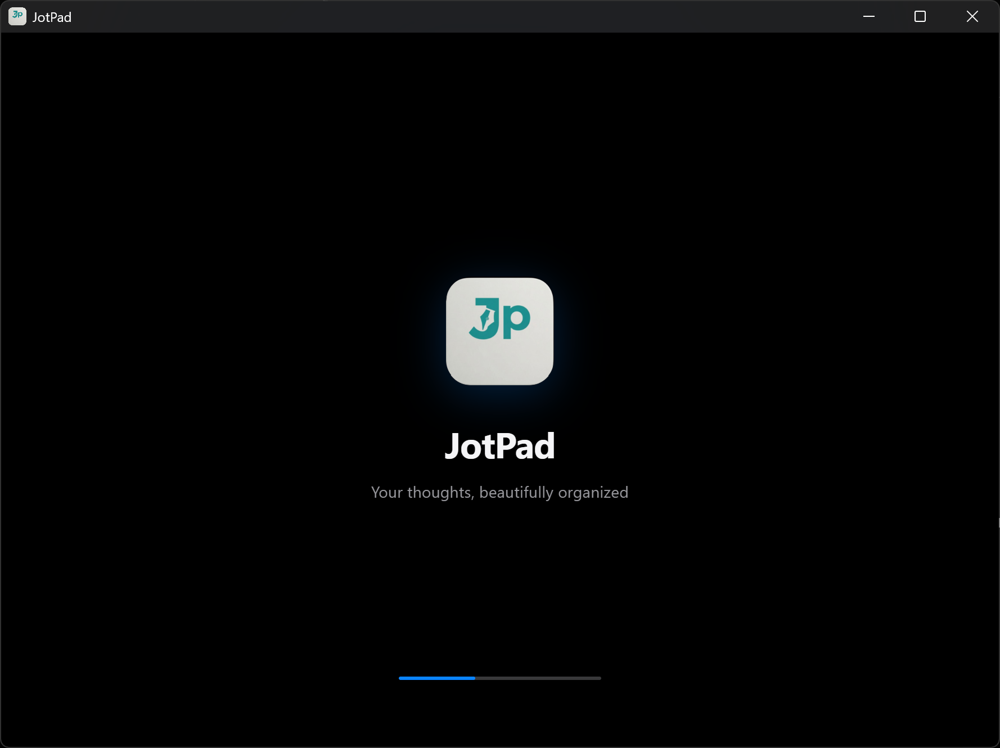

# JotPad 📝

[](https://opensource.org/licenses/MIT)
[](https://github.com/tanbiralam/JotPad/actions/workflows/build.yml)
[](https://github.com/tanbiralam/JotPad/issues)

**JotPad** is a modern, lightweight, and extensible note-taking desktop application built with **Electron**, **React**, and **TypeScript**.

It features a rich MDX-powered Markdown editor, atomic state management with Jotai, and seamless offline-first local file storage — designed for speed, simplicity, and excellent developer experience.

---

## 📥 Download (Latest)

- **[Download for Windows (.exe)](https://github.com/tanbiralam/JotPad/releases/download/v1.0.0/JotPad.Setup.1.0.0.exe)**
- [View all release files](https://github.com/tanbiralam/JotPad/releases/tag/v1.0.0)

---

## ✨ Key Features

- **Rich Markdown Editing** — Powered by [`@mdxeditor/editor`](https://mdxeditor.dev/), with live preview and block-based editing
- **Offline-First Storage** — Notes saved directly as `.md` and `.txt` files on your local machine (no cloud dependency)
- **Lightning-Fast Performance** — Atomic state management using [`jotai`](https://jotai.org/)
- **Beautiful & Clean UI** — Modern interface built with **Tailwind CSS**
- **Powerful Note Management** — Real-time search, pinning, soft-delete (Trash), and instant filtering
- **Cross-Platform** — Available for **Windows**, **macOS**, and **Linux**

---

## 📸 Screenshots

### 1. Main Editor



_Distraction-free markdown editor with live preview, block-based editing, and beautiful typography._

### 2. Notes Sidebar & Management



_Fast note navigation, real-time search, pinning, and soft-delete trash system._

---

> All screenshots taken on Windows 11. The application maintains a consistent, native look across **Windows**, **macOS**, and **Linux**.

---

## 🏗️ Technical Architecture

Built using the modern [`electron-vite`](https://electron-vite.org/) toolchain.

- **Main Process** (`src/main`): Handles file system operations and OS integrations using `fs-extra`.
- **Preload Script** (`src/preload`): Secure context bridge with fully typed IPC API.
- **Renderer Process** (`src/renderer`): React 18 + Vite frontend with Jotai for atomic state management.

### 📁 Project Structure

```text
JotPad/
├── build/                    # OS-specific application icons
├── resources/                # Assets for main process
├── src/
│   ├── main/                 # Electron main process (Node.js + File System)
│   ├── preload/              # Secure IPC bridge
│   ├── renderer/             # React + Vite frontend
│   │   ├── src/assets/       # CSS and static assets
│   │   ├── src/components/   # UI Components
│   │   ├── src/hooks/        # Custom React hooks
│   │   └── src/store/        # Jotai atoms
│   └── shared/               # Shared TypeScript types
└── electron.vite.config.ts
```
````

---

## 🚀 Getting Started

### Prerequisites

- **Node.js** v18 or higher
- **Git**

### Installation

```bash
git clone https://github.com/tanbiralam/JotPad.git
cd JotPad
npm install
```

### Development

```bash
npm run dev
```

### Packaging & Distribution

```bash
# Build for Windows
npm run build:win

# Build for macOS
npm run build:mac

# Build for Linux
npm run build:linux
```

The packaged files will be available in the `dist/` directory.

---

## 🛠️ Modifying the Application

**Changing the App Logo** requires updating these locations:

1. `resources/icon.png` — Used by the main application window
2. `build/icon.*` — Used by `electron-builder` for desktop icons (`.ico`, `.icns`, `.png`)
3. `src/renderer/src/assets/icon.png` — Used inside the UI (if applicable)

---

## 🤝 Contributing

We welcome contributions!

1. Fork the repository
2. Create your feature branch (`git checkout -b feature/amazing-feature`)
3. Commit your changes (`git commit -m 'Add some amazing feature'`)
4. Push to the branch (`git push origin feature/amazing-feature`)
5. Open a Pull Request

---

## 📜 License

Distributed under the **MIT License**. See [`LICENSE`](./LICENSE) for more details.

---

**Made with ❤️ by [Tanbir Alam](https://github.com/tanbiralam)**
